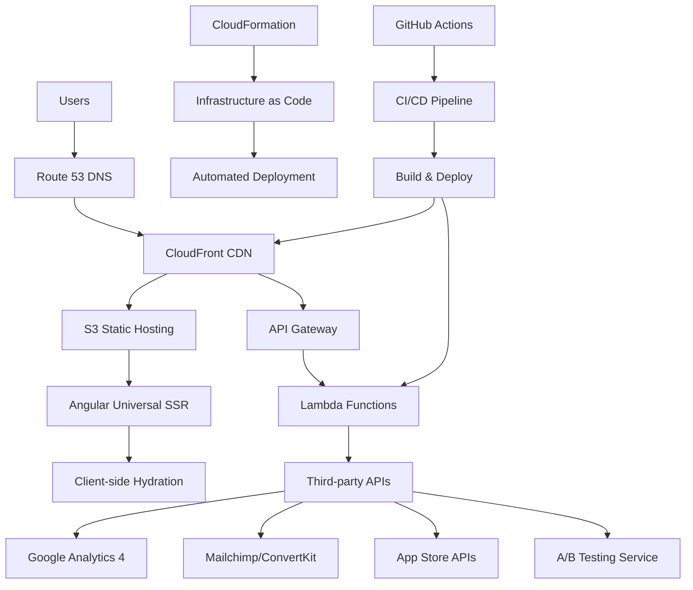
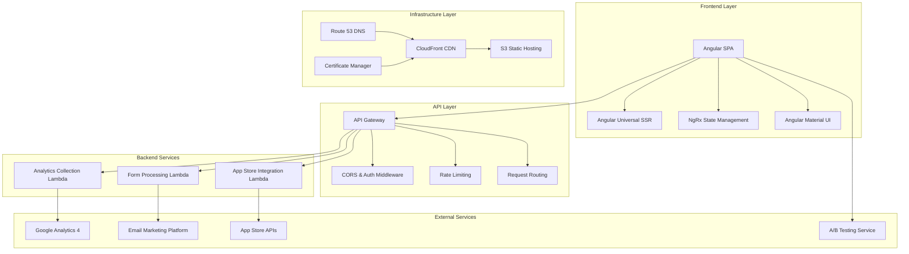
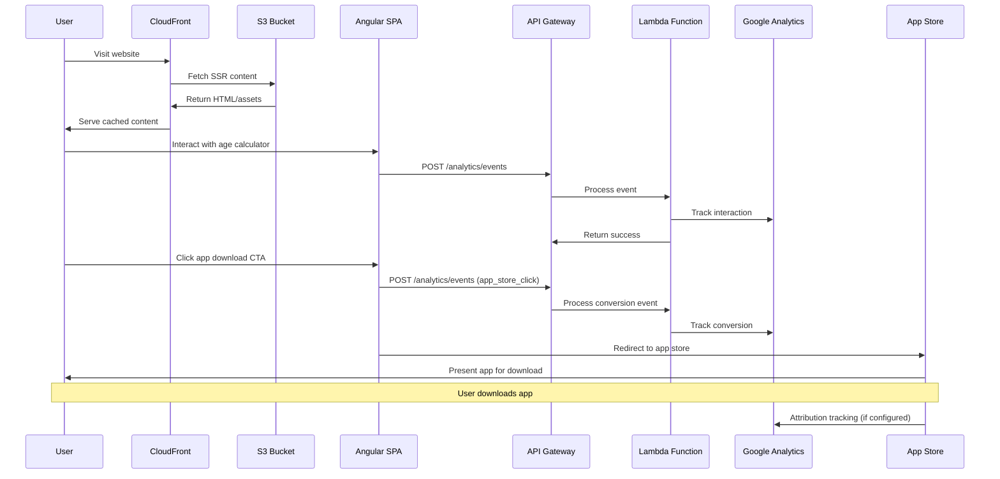
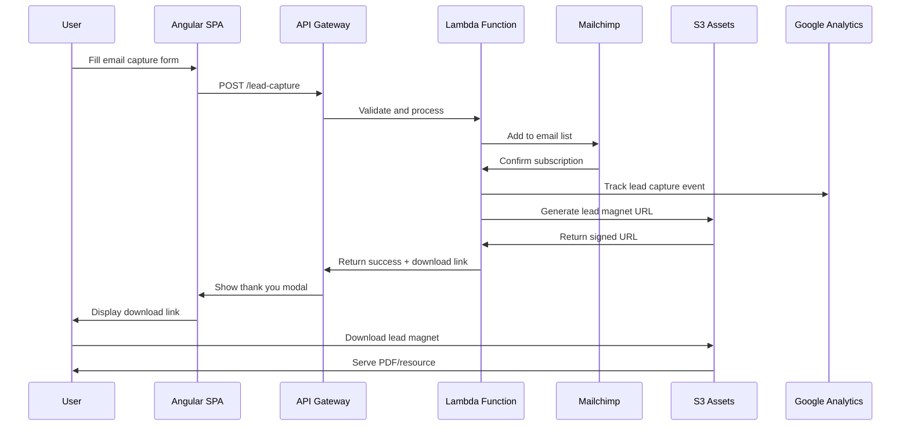
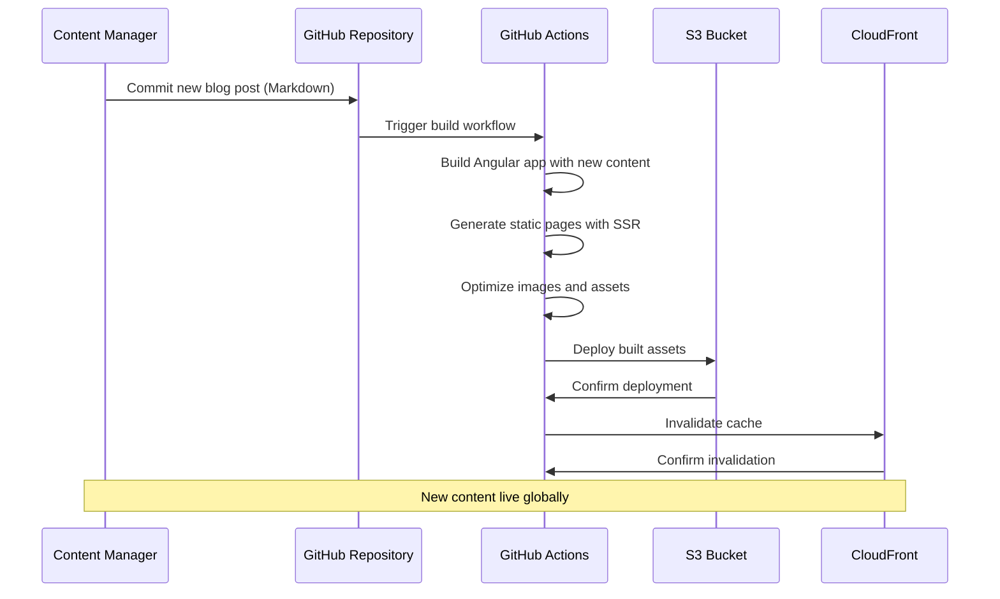
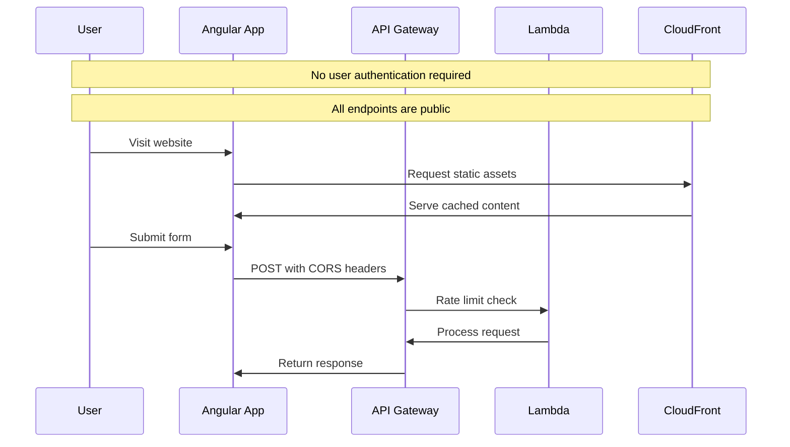
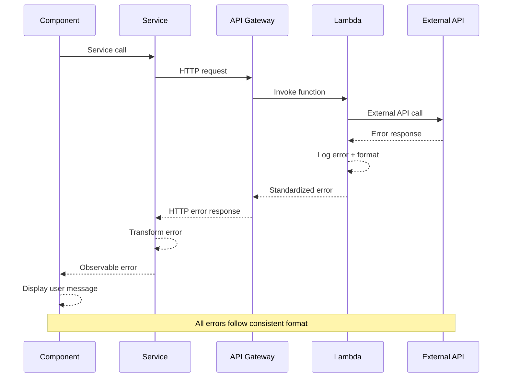

# Magerly Website Modernization Fullstack Architecture Document

## Introduction

This document outlines the complete fullstack architecture for Magerly Website Modernization, including backend systems, frontend implementation, and their integration. It serves as the single source of truth for AI-driven development, ensuring consistency across the entire technology stack.

This unified approach combines what would traditionally be separate backend and frontend architecture documents, streamlining the development process for modern fullstack applications where these concerns are increasingly intertwined.

### Starter Template or Existing Project

**N/A - Greenfield project** with custom Angular + AWS architecture optimized for specific conversion and SEO requirements. While Angular starters exist, the specific AWS infrastructure, SSR requirements, and performance targets necessitate a custom setup rather than constraining to an existing template.

### Change Log
| Date | Version | Description | Author |
|------|---------|-------------|---------|
| 2025-01-18 | 1.0 | Initial architecture document creation | Architect Team |

## High Level Architecture

### Technical Summary

The Magerly website modernization employs a **serverless-first Angular Universal architecture** hosted on AWS infrastructure, optimizing for SEO performance and global content delivery. The frontend utilizes Angular 17+ with Server-Side Rendering for optimal search engine visibility, while the backend leverages AWS Lambda functions for form processing and analytics collection. The architecture integrates multiple third-party services (Google Analytics 4, email marketing platforms, A/B testing tools) through a unified API gateway pattern, ensuring scalable performance under the $100/month hosting budget while achieving Core Web Vitals targets of LCP < 2.5s and 40% organic traffic growth.

### Platform and Infrastructure Choice

**Platform:** AWS (Amazon Web Services)
**Key Services:** S3 (Static Hosting), CloudFront (CDN), Lambda (Serverless Functions), API Gateway (API Management), Route 53 (DNS), Certificate Manager (SSL), CloudFormation (IaC)
**Deployment Host and Regions:** Primary: us-east-1 (N. Virginia), Secondary: eu-west-1 (Ireland) for global coverage

**Rationale:** AWS provides enterprise-grade infrastructure with granular cost control, excellent CDN performance via CloudFront, and seamless integration with serverless compute. The S3+CloudFront pattern is proven for static site hosting with Angular Universal, while Lambda enables cost-effective backend functionality without server management overhead.

### Repository Structure

**Structure:** Monorepo with workspace-based organization
**Monorepo Tool:** Nx (Angular-optimized with excellent TypeScript support)
**Package Organization:** Apps (web, functions), Libraries (shared types, utilities, components), Tools (build scripts, deployment)

### High Level Architecture Diagram



### Architectural Patterns

- **Jamstack Architecture:** Static site generation with serverless APIs - _Rationale:_ Optimal performance and scalability for content-heavy promotional websites with minimal backend requirements
- **Component-Based UI:** Reusable Angular components with TypeScript - _Rationale:_ Maintainability and type safety across large codebases with shared component library
- **API Gateway Pattern:** Single entry point for all API calls - _Rationale:_ Centralized auth, rate limiting, and monitoring for third-party integrations
- **Event-Driven Architecture:** Lambda functions triggered by user actions - _Rationale:_ Cost-effective processing of form submissions and analytics events
- **CDN-First Strategy:** CloudFront edge caching with aggressive optimization - _Rationale:_ Global performance for international users accessing baby development content
- **Progressive Enhancement:** Core functionality works without JavaScript - _Rationale:_ SEO optimization and accessibility for users with limited connectivity

## Tech Stack

### Technology Stack Table

| Category | Technology | Version | Purpose | Rationale |
|----------|------------|---------|---------|-----------|
| Frontend Language | TypeScript | 5.3+ | Type-safe Angular development | Enhanced developer experience and runtime error prevention |
| Frontend Framework | Angular | 17+ | SPA with SSR capabilities | Excellent SSR support, mature ecosystem, TypeScript-first |
| UI Component Library | Angular Material | 17+ | Accessible component foundation | WCAG compliance out-of-box, consistent design system |
| State Management | NgRx | 17+ | Complex state management | Predictable state updates, DevTools support, scalability |
| Backend Language | TypeScript | 5.3+ | Unified language across stack | Code sharing, consistent developer experience |
| Backend Framework | AWS Lambda | Runtime 20.x | Serverless function execution | Cost-effective, auto-scaling, zero server management |
| API Style | REST | OpenAPI 3.0 | Simple HTTP-based APIs | Wide tool support, caching-friendly, straightforward integration |
| Database | None | N/A | No persistent storage needed | Promotional site with third-party data sources only |
| Cache | CloudFront | Latest | Global content delivery | CDN caching, edge locations, cost-effective bandwidth |
| File Storage | S3 | Latest | Static asset hosting | Reliable storage, CloudFront integration, cost-effective |
| Authentication | None | N/A | No user accounts required | Promotional site with anonymous users only |
| Frontend Testing | Jest + Testing Library | Latest | Unit and integration tests | Angular ecosystem standard, component testing focus |
| Backend Testing | Jest + Supertest | Latest | Lambda function testing | JavaScript testing standard, API testing capabilities |
| E2E Testing | Playwright | Latest | End-to-end user flows | Cross-browser testing, reliable selectors, CI-friendly |
| Build Tool | Nx | Latest | Monorepo build orchestration | Angular optimization, incremental builds, dependency graph |
| Bundler | esbuild | Latest | Fast JavaScript bundling | Performance-focused, Angular Universal compatible |
| IaC Tool | CloudFormation | Latest | Infrastructure as Code | YAML-based, AWS-native, mature tooling, broad team familiarity |
| CI/CD | GitHub Actions | Latest | Automated testing and deployment | Free for public repos, excellent AWS integration |
| Monitoring | CloudWatch + Sentry | Latest | Performance and error tracking | AWS-native monitoring, frontend error tracking |
| Logging | CloudWatch Logs | Latest | Centralized log aggregation | Lambda integration, searchable logs, cost-effective |
| CSS Framework | Tailwind CSS | 3.4+ | Utility-first styling | Rapid development, small bundle size, design consistency |

## Data Models

### Lead Capture Model

**Purpose:** Capture email addresses and baby information for newsletter signup and lead magnets

**Key Attributes:**
- email: string - User's email address for marketing communications
- babyName: string (optional) - Personalization for future communications
- babyBirthDate: Date (optional) - Age-specific content targeting
- leadMagnetType: string - Which lead magnet prompted signup
- source: string - Traffic source attribution
- timestamp: Date - Signup time for campaign analysis
- ipAddress: string - Geographic analytics and fraud prevention

#### TypeScript Interface

```typescript
interface LeadCapture {
  id: string;
  email: string;
  babyName?: string;
  babyBirthDate?: Date;
  leadMagnetType: 'milestone-checklist' | 'newsletter' | 'age-calculator';
  source: string;
  timestamp: Date;
  ipAddress: string;
  consent: boolean;
}
```

#### Relationships
- Related to AnalyticsEvent for conversion tracking
- Connected to EmailMarketingPlatform for list management

### Analytics Event Model

**Purpose:** Track user interactions and conversion events for optimization analysis

**Key Attributes:**
- eventType: string - Categorized user action
- userId: string - Anonymous session identifier
- properties: Record<string, any> - Event-specific metadata
- timestamp: Date - Event occurrence time
- sessionId: string - User session tracking
- userAgent: string - Device and browser information

#### TypeScript Interface

```typescript
interface AnalyticsEvent {
  id: string;
  eventType: 'page_view' | 'app_store_click' | 'email_signup' | 'age_calculator_use' | 'faq_interaction';
  userId: string;
  sessionId: string;
  properties: Record<string, any>;
  timestamp: Date;
  userAgent: string;
  referrer?: string;
}
```

#### Relationships
- Aggregated for dashboard analytics
- Linked to A/B test experiment tracking

## API Specification

### REST API Specification

```yaml
openapi: 3.0.0
info:
  title: Magerly Website API
  version: 1.0.0
  description: Backend API for form processing and analytics collection
servers:
  - url: https://api.magerly.life
    description: Production API Gateway

paths:
  /lead-capture:
    post:
      summary: Capture email lead with optional baby information
      requestBody:
        required: true
        content:
          application/json:
            schema:
              $ref: '#/components/schemas/LeadCaptureRequest'
      responses:
        '201':
          description: Lead successfully captured
          content:
            application/json:
              schema:
                $ref: '#/components/schemas/LeadCaptureResponse'
        '400':
          description: Invalid request data
        '429':
          description: Rate limit exceeded

  /analytics/events:
    post:
      summary: Track user interaction events
      requestBody:
        required: true
        content:
          application/json:
            schema:
              $ref: '#/components/schemas/AnalyticsEventRequest'
      responses:
        '204':
          description: Event successfully tracked
        '400':
          description: Invalid event data

  /contact:
    post:
      summary: Contact form submission
      requestBody:
        required: true
        content:
          application/json:
            schema:
              $ref: '#/components/schemas/ContactRequest'
      responses:
        '201':
          description: Message sent successfully
        '400':
          description: Invalid contact data

  /app-store-ratings:
    get:
      summary: Fetch current app store ratings
      responses:
        '200':
          description: Current ratings data
          content:
            application/json:
              schema:
                $ref: '#/components/schemas/AppStoreRatings'

components:
  schemas:
    LeadCaptureRequest:
      type: object
      required:
        - email
        - leadMagnetType
        - consent
      properties:
        email:
          type: string
          format: email
        babyName:
          type: string
          maxLength: 50
        babyBirthDate:
          type: string
          format: date
        leadMagnetType:
          type: string
          enum: ['milestone-checklist', 'newsletter', 'age-calculator']
        source:
          type: string
        consent:
          type: boolean

    LeadCaptureResponse:
      type: object
      properties:
        success:
          type: boolean
        leadMagnetUrl:
          type: string
        message:
          type: string

    AnalyticsEventRequest:
      type: object
      required:
        - eventType
        - userId
        - sessionId
      properties:
        eventType:
          type: string
        userId:
          type: string
        sessionId:
          type: string
        properties:
          type: object
        timestamp:
          type: string
          format: date-time

    ContactRequest:
      type: object
      required:
        - name
        - email
        - message
      properties:
        name:
          type: string
          maxLength: 100
        email:
          type: string
          format: email
        message:
          type: string
          maxLength: 1000
        subject:
          type: string
          maxLength: 200

    AppStoreRatings:
      type: object
      properties:
        ios:
          type: object
          properties:
            rating:
              type: number
            reviewCount:
              type: integer
        android:
          type: object
          properties:
            rating:
              type: number
            reviewCount:
              type: integer
```

## Components

### Frontend Application (Angular SPA)

**Responsibility:** User interface rendering, client-side interactions, and SSR generation for SEO optimization

**Key Interfaces:**
- Angular Universal for server-side rendering
- HttpClient for API communication
- Router for navigation management
- NgRx store for state management

**Dependencies:** API Gateway for backend communication, third-party analytics scripts

**Technology Stack:** Angular 17+, TypeScript, Angular Material, Tailwind CSS, NgRx

### API Gateway Service

**Responsibility:** Request routing, authentication, rate limiting, and CORS management for Lambda functions

**Key Interfaces:**
- REST API endpoints for frontend communication
- Lambda function integration
- CloudWatch logging integration

**Dependencies:** Lambda functions, CloudWatch, WAF for security

**Technology Stack:** AWS API Gateway, CloudWatch, AWS WAF

### Form Processing Service (Lambda)

**Responsibility:** Handle form submissions, data validation, and third-party service integration

**Key Interfaces:**
- Email marketing platform APIs
- Analytics service APIs
- Response formatting and error handling

**Dependencies:** Mailchimp/ConvertKit API, Google Analytics API, CloudWatch Logs

**Technology Stack:** AWS Lambda (Node.js), TypeScript, AWS SDK

### Analytics Collection Service (Lambda)

**Responsibility:** Process user interaction events and forward to analytics platforms

**Key Interfaces:**
- Google Analytics 4 Measurement Protocol
- Custom analytics dashboard APIs
- Event data validation and enrichment

**Dependencies:** Google Analytics 4, CloudWatch Metrics

**Technology Stack:** AWS Lambda (Node.js), Google Analytics SDK, AWS CloudWatch

### App Store Integration Service (Lambda)

**Responsibility:** Fetch real-time app store ratings and download statistics

**Key Interfaces:**
- iOS App Store Connect API
- Google Play Console API
- Data caching and rate limit management

**Dependencies:** App Store APIs, CloudWatch for monitoring

**Technology Stack:** AWS Lambda (Node.js), App Store SDKs, Redis for caching

### CDN and Static Hosting

**Responsibility:** Global content delivery, SSL termination, and static asset serving

**Key Interfaces:**
- S3 bucket integration for origin content
- Custom domain and SSL certificate management
- Cache invalidation and purging

**Dependencies:** S3 bucket, Route 53 DNS, Certificate Manager

**Technology Stack:** AWS CloudFront, S3, Route 53, Certificate Manager

### Component Diagrams



## External APIs

### Google Analytics 4 API

- **Purpose:** Track user behavior, conversion funnels, and performance metrics
- **Documentation:** https://developers.google.com/analytics/devguides/collection/ga4
- **Base URL(s):** https://www.google-analytics.com/mp/collect
- **Authentication:** Measurement ID and API Secret
- **Rate Limits:** 20 million events per property per day

**Key Endpoints Used:**
- `POST /mp/collect` - Send measurement events for user tracking

**Integration Notes:** Custom events for app download tracking, age calculator usage, and email signups. Enhanced ecommerce tracking for conversion attribution.

### Mailchimp/ConvertKit API

- **Purpose:** Email list management and automated marketing campaigns
- **Documentation:** https://mailchimp.com/developer/marketing/
- **Base URL(s):** https://[datacenter].api.mailchimp.com/3.0/
- **Authentication:** API Key with OAuth 2.0 support
- **Rate Limits:** 10 requests per second per account

**Key Endpoints Used:**
- `POST /lists/{list_id}/members` - Add email subscribers with baby information
- `GET /lists/{list_id}/members` - Retrieve subscriber information for analytics

**Integration Notes:** Automated tagging based on baby age and lead magnet type. GDPR-compliant double opt-in process with proper consent tracking.

### App Store Connect API (iOS)

- **Purpose:** Retrieve app ratings, reviews, and download statistics
- **Documentation:** https://developer.apple.com/documentation/appstoreconnectapi
- **Base URL(s):** https://api.appstoreconnect.apple.com/v1/
- **Authentication:** JWT with private key
- **Rate Limits:** 2500 requests per hour per organization

**Key Endpoints Used:**
- `GET /v1/apps/{app_id}/customerReviews` - Fetch recent reviews and ratings

**Integration Notes:** Hourly synchronization of ratings data with caching for real-time display on website.

### Google Play Console API (Android)

- **Purpose:** Android app ratings and statistics retrieval
- **Documentation:** https://developers.google.com/android-publisher
- **Base URL(s):** https://androidpublisher.googleapis.com/androidpublisher/v3/
- **Authentication:** Service Account with JSON key
- **Rate Limits:** 200,000 requests per day

**Key Endpoints Used:**
- `GET /androidpublisher/v3/applications/{packageName}/reviews` - Get app reviews and ratings

**Integration Notes:** Combined with iOS data for unified social proof display. Cached responses to minimize API calls and costs.

### A/B Testing Service (Google Optimize or VWO)

- **Purpose:** Conversion rate optimization through multivariate testing
- **Documentation:** https://developers.google.com/optimize
- **Base URL(s):** Client-side JavaScript integration
- **Authentication:** Container ID and measurement ID
- **Rate Limits:** Based on Google Analytics quotas

**Key Endpoints Used:**
- Client-side integration for experiment delivery and result tracking

**Integration Notes:** Angular-compatible implementation with SSR considerations. Test variations for headlines, CTA buttons, and age calculator placement.

## Core Workflows

### User Registration and App Download Flow



### Email Capture and Lead Magnet Delivery



### Content Management and Blog Publishing



## Database Schema

**No persistent database required** for this promotional website architecture. All data is handled through:

1. **Third-party services** (email marketing platforms, analytics)
2. **Temporary Lambda execution context** for request processing
3. **Client-side local storage** for user preferences (baby age, etc.)
4. **CloudWatch Logs** for audit trails and debugging

This approach eliminates database costs and maintenance while maintaining the stateless, serverless architecture pattern.

## Frontend Architecture

### Component Architecture

#### Component Organization

```
src/
├── app/
│   ├── core/                    # Singleton services
│   │   ├── services/           # App-wide services
│   │   ├── guards/             # Route guards
│   │   └── interceptors/       # HTTP interceptors
│   ├── shared/                 # Shared components
│   │   ├── components/         # Reusable UI components
│   │   ├── directives/         # Custom directives
│   │   ├── pipes/              # Custom pipes
│   │   └── models/             # TypeScript interfaces
│   ├── features/               # Feature modules
│   │   ├── home/               # Landing page components
│   │   ├── blog/               # Blog functionality
│   │   ├── legal/              # Privacy/Terms pages
│   │   └── analytics/          # Analytics components
│   ├── layout/                 # Layout components
│   │   ├── header/
│   │   ├── footer/
│   │   └── navigation/
│   └── app.component.ts        # Root component
```

#### Component Template

```typescript
import { Component, Input, Output, EventEmitter, ChangeDetectionStrategy } from '@angular/core';
import { CommonModule } from '@angular/common';

@Component({
  selector: 'app-download-button',
  standalone: true,
  imports: [CommonModule],
  changeDetection: ChangeDetectionStrategy.OnPush,
  template: `
    <button 
      [class]="buttonClasses"
      [disabled]="loading"
      (click)="handleClick()"
      [attr.aria-label]="ariaLabel"
    >
      @if (loading) {
        <span class="loading-spinner" aria-hidden="true"></span>
      }
      <span>{{ buttonText }}</span>
    </button>
  `,
  styleUrls: ['./download-button.component.scss']
})
export class DownloadButtonComponent {
  @Input() platform: 'ios' | 'android' = 'ios';
  @Input() loading = false;
  @Input() variant: 'primary' | 'secondary' = 'primary';
  
  @Output() download = new EventEmitter<string>();
  
  get buttonText(): string {
    return this.platform === 'ios' ? 'Download on App Store' : 'Get it on Google Play';
  }
  
  get ariaLabel(): string {
    return `Download Magerly app for ${this.platform}`;
  }
  
  get buttonClasses(): string {
    const base = 'download-btn';
    const platformClass = `download-btn--${this.platform}`;
    const variantClass = `download-btn--${this.variant}`;
    const loadingClass = this.loading ? 'download-btn--loading' : '';
    
    return [base, platformClass, variantClass, loadingClass].filter(Boolean).join(' ');
  }
  
  handleClick(): void {
    if (!this.loading) {
      this.download.emit(this.platform);
    }
  }
}
```

### State Management Architecture

#### State Structure

```typescript
// Global application state
interface AppState {
  ui: UiState;
  analytics: AnalyticsState;
  user: UserState;
  content: ContentState;
}

interface UiState {
  loading: boolean;
  sidebarOpen: boolean;
  currentModal: string | null;
  notifications: Notification[];
}

interface AnalyticsState {
  sessionId: string;
  userId: string;
  events: AnalyticsEvent[];
  experiments: ABTestExperiment[];
}

interface UserState {
  babyAge?: number;
  preferences: UserPreferences;
  hasSeenEmailModal: boolean;
}

interface ContentState {
  blogPosts: BlogPost[];
  faqs: FAQ[];
  testimonials: Testimonial[];
  appStoreRatings: AppStoreRatings;
}
```

#### State Management Patterns

- **Feature State Modules:** Each feature has its own NgRx module with actions, reducers, and effects
- **Facade Pattern:** Services abstract NgRx complexity from components
- **Entity State Management:** Use @ngrx/entity for normalized data storage
- **Effect Isolation:** Side effects contained within feature-specific effect classes
- **Selector Composition:** Memoized selectors for efficient state derivation

### Routing Architecture

#### Route Organization

```
/                           # Home page (landing)
├── /privacy               # Privacy policy
├── /terms                 # Terms of service
├── /blog                  # Blog listing page
│   └── /blog/:slug        # Individual blog posts
├── /contact               # Contact page
└── /**                    # 404 error page
```

#### Protected Route Pattern

```typescript
import { inject } from '@angular/core';
import { CanActivateFn, Router } from '@angular/router';
import { AnalyticsService } from '../services/analytics.service';

export const analyticsGuard: CanActivateFn = (route, state) => {
  const analyticsService = inject(AnalyticsService);
  const router = inject(Router);
  
  // Track page view for all routes
  analyticsService.trackPageView(state.url);
  
  // Allow all routes (no authentication needed)
  return true;
};

// Route configuration
const routes: Routes = [
  {
    path: '',
    component: HomeComponent,
    canActivate: [analyticsGuard],
    data: { title: 'Magerly - Baby Development App' }
  },
  {
    path: 'blog/:slug',
    component: BlogPostComponent,
    canActivate: [analyticsGuard],
    resolve: { post: blogPostResolver }
  }
];
```

### Frontend Services Layer

#### API Client Setup

```typescript
import { Injectable } from '@angular/core';
import { HttpClient, HttpErrorResponse } from '@angular/common/http';
import { Observable, throwError } from 'rxjs';
import { catchError, retry } from 'rxjs/operators';
import { environment } from '../../environments/environment';

@Injectable({
  providedIn: 'root'
})
export class ApiService {
  private readonly baseUrl = environment.apiUrl;
  
  constructor(private http: HttpClient) {}
  
  private handleError(error: HttpErrorResponse) {
    console.error('API Error:', error);
    return throwError(() => new Error(error.message || 'Server error'));
  }
  
  get<T>(endpoint: string): Observable<T> {
    return this.http.get<T>(`${this.baseUrl}${endpoint}`)
      .pipe(
        retry(2),
        catchError(this.handleError)
      );
  }
  
  post<T>(endpoint: string, data: any): Observable<T> {
    return this.http.post<T>(`${this.baseUrl}${endpoint}`, data)
      .pipe(
        catchError(this.handleError)
      );
  }
}
```

#### Service Example

```typescript
import { Injectable } from '@angular/core';
import { Observable } from 'rxjs';
import { ApiService } from './api.service';
import { LeadCapture, LeadCaptureResponse } from '../models/lead-capture.model';

@Injectable({
  providedIn: 'root'
})
export class LeadCaptureService {
  constructor(private apiService: ApiService) {}
  
  captureEmail(leadData: LeadCapture): Observable<LeadCaptureResponse> {
    return this.apiService.post<LeadCaptureResponse>('/lead-capture', leadData);
  }
  
  trackEmailSignup(email: string, source: string): Observable<void> {
    return this.apiService.post<void>('/analytics/events', {
      eventType: 'email_signup',
      properties: { email, source },
      timestamp: new Date().toISOString()
    });
  }
}
```

## Backend Architecture

### Service Architecture

#### Function Organization

```
functions/
├── lead-capture/           # Email capture processing
│   ├── handler.ts         # Lambda entry point
│   ├── validation.ts      # Input validation
│   ├── mailchimp.ts       # Email service integration
│   └── types.ts           # TypeScript interfaces
├── analytics/             # Event tracking
│   ├── handler.ts         # Event processing
│   ├── ga4.ts             # Google Analytics integration
│   └── types.ts           # Event type definitions
├── app-store/             # Rating fetching
│   ├── handler.ts         # Lambda entry point
│   ├── ios.ts             # App Store Connect API
│   ├── android.ts         # Google Play API
│   └── cache.ts           # Response caching
├── contact/               # Contact form
│   ├── handler.ts         # Form processing
│   ├── email.ts           # Email sending
│   └── validation.ts      # Form validation
└── shared/                # Shared utilities
    ├── cors.ts            # CORS configuration
    ├── error-handler.ts   # Error handling
    ├── logger.ts          # Logging utilities
    └── types.ts           # Shared types
```

#### Function Template

```typescript
import { APIGatewayProxyEvent, APIGatewayProxyResult } from 'aws-lambda';
import { corsHeaders, handleError, validateInput } from '../shared';
import { LeadCaptureSchema } from './validation';
import { addToMailchimp } from './mailchimp';
import { trackGA4Event } from '../shared/analytics';

export const handler = async (
  event: APIGatewayProxyEvent
): Promise<APIGatewayProxyResult> => {
  try {
    // Parse and validate input
    const body = JSON.parse(event.body || '{}');
    const validatedData = validateInput(body, LeadCaptureSchema);
    
    // Process business logic
    const result = await addToMailchimp(validatedData);
    
    // Track analytics
    await trackGA4Event({
      eventType: 'email_signup',
      userId: event.headers['x-user-id'] || 'anonymous',
      properties: {
        leadMagnetType: validatedData.leadMagnetType,
        source: validatedData.source
      }
    });
    
    // Return success response
    return {
      statusCode: 201,
      headers: corsHeaders,
      body: JSON.stringify({
        success: true,
        message: 'Email captured successfully',
        leadMagnetUrl: result.leadMagnetUrl
      })
    };
    
  } catch (error) {
    console.error('Lead capture error:', error);
    return handleError(error);
  }
};
```

### Database Architecture

**No traditional database required.** Data persistence handled through:

1. **Third-party APIs** for permanent storage (Mailchimp, Google Analytics)
2. **CloudWatch Logs** for audit trails and debugging
3. **Lambda execution context** for temporary processing
4. **Client-side storage** for user preferences

### Authentication and Authorization

#### Auth Flow



#### Middleware/Guards

```typescript
// CORS and security middleware for Lambda
export const corsMiddleware = {
  headers: {
    'Access-Control-Allow-Origin': 'https://magerly.life',
    'Access-Control-Allow-Headers': 'Content-Type,X-Amz-Date,Authorization,X-Api-Key,X-Amz-Security-Token',
    'Access-Control-Allow-Methods': 'GET,POST,OPTIONS',
    'Content-Security-Policy': "default-src 'self'; script-src 'self' 'unsafe-inline' *.google-analytics.com *.googletagmanager.com",
    'X-Content-Type-Options': 'nosniff',
    'X-Frame-Options': 'DENY',
    'X-XSS-Protection': '1; mode=block'
  }
};

// Rate limiting for form submissions
export const rateLimitGuard = async (event: APIGatewayProxyEvent) => {
  const clientIp = event.requestContext.identity.sourceIp;
  const key = `rate_limit:${clientIp}`;
  
  // Implementation would use DynamoDB for distributed rate limiting
  // For this project, API Gateway throttling is sufficient
  return true;
};
```

## Unified Project Structure

```
magerly-website/
├── .github/                    # CI/CD workflows
│   └── workflows/
│       ├── ci.yaml            # Test and build
│       ├── deploy-staging.yaml # Staging deployment
│       └── deploy-prod.yaml   # Production deployment
├── apps/                      # Application packages
│   ├── web/                   # Angular frontend
│   │   ├── src/
│   │   │   ├── app/           # Angular application
│   │   │   │   ├── components/ # UI components
│   │   │   │   ├── pages/     # Page components
│   │   │   │   ├── services/  # Frontend services
│   │   │   │   ├── store/     # NgRx state management
│   │   │   │   └── shared/    # Shared utilities
│   │   │   ├── assets/        # Static assets
│   │   │   ├── environments/  # Environment configs
│   │   │   └── styles/        # Global styles
│   │   ├── tests/             # Frontend tests
│   │   ├── angular.json       # Angular CLI config
│   │   └── package.json
│   └── functions/             # Lambda functions
│       ├── src/
│       │   ├── lead-capture/  # Email capture handler
│       │   ├── analytics/     # Event tracking handler
│       │   ├── app-store/     # Rating fetcher
│       │   ├── contact/       # Contact form handler
│       │   └── shared/        # Shared utilities
│       ├── tests/             # Backend tests
│       └── package.json
├── packages/                  # Shared packages
│   ├── shared/                # Shared types/utilities
│   │   ├── src/
│   │   │   ├── types/         # TypeScript interfaces
│   │   │   ├── constants/     # Shared constants
│   │   │   ├── utils/         # Shared utilities
│   │   │   └── validation/    # Validation schemas
│   │   └── package.json
│   ├── ui/                    # Shared UI components
│   │   ├── src/
│   │   │   ├── components/    # Reusable components
│   │   │   ├── styles/        # Component styles
│   │   │   └── tokens/        # Design tokens
│   │   └── package.json
│   └── config/                # Shared configuration
│       ├── eslint/           # ESLint configurations
│       ├── typescript/       # TypeScript configurations
│       ├── jest/             # Jest configurations
│       └── tailwind/         # Tailwind configurations
├── infrastructure/            # CloudFormation templates
│   ├── templates/
│   │   ├── web-stack.yaml    # S3 + CloudFront
│   │   ├── api-stack.yaml    # API Gateway + Lambda
│   │   ├── dns-stack.yaml    # Route 53 + certificates
│   │   └── monitoring-stack.yaml # CloudWatch + alarms
│   ├── parameters/           # Parameter files
│   │   ├── dev.json          # Development parameters
│   │   ├── staging.json      # Staging parameters
│   │   └── prod.json         # Production parameters
│   ├── scripts/              # Deployment scripts
│   │   ├── deploy.sh         # Deployment automation
│   │   └── validate.sh       # Template validation
│   └── nested/               # Nested stack templates
├── scripts/                   # Build/deploy scripts
│   ├── build.sh              # Build all applications
│   ├── deploy.sh             # Deploy to AWS
│   ├── test.sh               # Run all tests
│   └── dev.sh                # Start local development
├── docs/                      # Documentation
│   ├── prd.md
│   ├── front-end-spec.md
│   ├── architecture.md
│   └── deployment.md
├── .env.example               # Environment template
├── package.json               # Root package.json
├── nx.json                    # Nx configuration
├── tsconfig.base.json         # Base TypeScript config
├── .gitignore
└── README.md
```

## Development Workflow

### Local Development Setup

#### Prerequisites

```bash
# Install Node.js 20+
nvm install 20
nvm use 20

# Install global dependencies
npm install -g @angular/cli@17 aws-cli nx

# Install AWS CLI for local development
# macOS: brew install awscli
# Windows: Download from AWS website
# Linux: apt-get install awscli
```

#### Initial Setup

```bash
# Clone repository
git clone https://github.com/magerly/website.git
cd website

# Install dependencies
npm install

# Copy environment template
cp .env.example .env.local

# Build shared packages
nx build shared
nx build ui

# Validate CloudFormation templates (first time only)
cd infrastructure
aws cloudformation validate-template --template-body file://templates/web-stack.yaml
cd ..
```

#### Development Commands

```bash
# Start all services
npm run dev

# Start frontend only
nx serve web

# Start backend functions locally
nx serve functions

# Run tests
npm run test
nx test web              # Frontend tests only
nx test functions        # Backend tests only
nx e2e web              # End-to-end tests

# Build for production
npm run build
nx build web --configuration=production
nx build functions
```

### Environment Configuration

#### Required Environment Variables

```bash
# Frontend (.env.local)
NG_APP_API_URL=http://localhost:3333/api
NG_APP_GA_MEASUREMENT_ID=G-XXXXXXXXXX
NG_APP_AB_TEST_CONTAINER_ID=GTM-XXXXXXX
NG_APP_ENVIRONMENT=development

# Backend (.env)
MAILCHIMP_API_KEY=your_mailchimp_api_key
MAILCHIMP_LIST_ID=your_list_id
GA4_MEASUREMENT_ID=G-XXXXXXXXXX
GA4_API_SECRET=your_ga4_api_secret
APP_STORE_CONNECT_KEY_ID=your_key_id
APP_STORE_CONNECT_PRIVATE_KEY=path_to_private_key
GOOGLE_PLAY_SERVICE_ACCOUNT=path_to_service_account.json

# Shared
AWS_REGION=us-east-1
AWS_ACCOUNT_ID=123456789012
DOMAIN_NAME=magerly.life
CERTIFICATE_ARN=arn:aws:acm:us-east-1:123456789012:certificate/abc123
```

## Deployment Architecture

### Deployment Strategy

**Frontend Deployment:**
- **Platform:** AWS S3 + CloudFront CDN
- **Build Command:** `nx build web --configuration=production`
- **Output Directory:** `dist/apps/web`
- **CDN/Edge:** CloudFront with aggressive caching, gzip compression

**Backend Deployment:**
- **Platform:** AWS Lambda via API Gateway
- **Build Command:** `nx build functions --configuration=production`
- **Deployment Method:** AWS CloudFormation with Infrastructure as Code

### CI/CD Pipeline

```yaml
name: Deploy to AWS

on:
  push:
    branches: [main]
  pull_request:
    branches: [main]

jobs:
  test:
    runs-on: ubuntu-latest
    steps:
      - uses: actions/checkout@v4
      - uses: actions/setup-node@v4
        with:
          node-version: '20'
          cache: 'npm'
      
      - name: Install dependencies
        run: npm ci
      
      - name: Build shared packages
        run: |
          nx build shared
          nx build ui
      
      - name: Lint
        run: |
          nx lint web
          nx lint functions
      
      - name: Test
        run: |
          nx test web --coverage
          nx test functions --coverage
      
      - name: E2E Tests
        run: nx e2e web

  deploy-staging:
    if: github.event_name == 'pull_request'
    needs: test
    runs-on: ubuntu-latest
    environment: staging
    steps:
      - uses: actions/checkout@v4
      - uses: actions/setup-node@v4
        with:
          node-version: '20'
          cache: 'npm'
      
      - name: Configure AWS credentials
        uses: aws-actions/configure-aws-credentials@v4
        with:
          aws-access-key-id: ${{ secrets.AWS_ACCESS_KEY_ID }}
          aws-secret-access-key: ${{ secrets.AWS_SECRET_ACCESS_KEY }}
          aws-region: us-east-1
      
      - name: Install dependencies
        run: npm ci
      
      - name: Build applications
        run: |
          nx build shared
          nx build ui
          nx build web --configuration=staging
          nx build functions --configuration=staging
      
      - name: Deploy infrastructure
        run: |
          cd infrastructure
          ./scripts/deploy.sh staging
        env:
          ENVIRONMENT: staging

  deploy-production:
    if: github.ref == 'refs/heads/main'
    needs: test
    runs-on: ubuntu-latest
    environment: production
    steps:
      - uses: actions/checkout@v4
      - uses: actions/setup-node@v4
        with:
          node-version: '20'
          cache: 'npm'
      
      - name: Configure AWS credentials
        uses: aws-actions/configure-aws-credentials@v4
        with:
          aws-access-key-id: ${{ secrets.AWS_ACCESS_KEY_ID }}
          aws-secret-access-key: ${{ secrets.AWS_SECRET_ACCESS_KEY }}
          aws-region: us-east-1
      
      - name: Install dependencies
        run: npm ci
      
      - name: Build applications
        run: |
          nx build shared
          nx build ui
          nx build web --configuration=production
          nx build functions --configuration=production
      
      - name: Deploy infrastructure
        run: |
          cd infrastructure
          ./scripts/deploy.sh production
        env:
          ENVIRONMENT: production
      
      - name: Invalidate CloudFront
        run: |
          aws cloudfront create-invalidation \
            --distribution-id ${{ secrets.CLOUDFRONT_DISTRIBUTION_ID }} \
            --paths "/*"
```

### Environments

| Environment | Frontend URL | Backend URL | Purpose |
|-------------|-------------|-------------|----------|
| Development | http://localhost:4200 | http://localhost:3333 | Local development |
| Staging | https://staging.magerly.life | https://api-staging.magerly.life | Pre-production testing |
| Production | https://magerly.life | https://api.magerly.life | Live environment |

#### CloudFormation Deployment Script

```bash
#!/bin/bash
# infrastructure/scripts/deploy.sh

set -e

ENVIRONMENT=$1
if [ -z "$ENVIRONMENT" ]; then
  echo "Usage: $0 <environment>"
  echo "Example: $0 staging"
  exit 1
fi

echo "Deploying to $ENVIRONMENT environment..."

# Load environment-specific parameters
PARAM_FILE="parameters/${ENVIRONMENT}.json"
if [ ! -f "$PARAM_FILE" ]; then
  echo "Parameter file not found: $PARAM_FILE"
  exit 1
fi

# Deploy web infrastructure stack (S3 + CloudFront)
echo "Deploying web infrastructure stack..."
aws cloudformation deploy \
  --template-file templates/web-stack.yaml \
  --stack-name magerly-web-${ENVIRONMENT} \
  --parameter-overrides file://$PARAM_FILE \
  --capabilities CAPABILITY_IAM \
  --no-fail-on-empty-changeset

# Deploy API infrastructure stack (API Gateway + Lambda)
echo "Deploying API infrastructure stack..."
aws cloudformation deploy \
  --template-file templates/api-stack.yaml \
  --stack-name magerly-api-${ENVIRONMENT} \
  --parameter-overrides file://$PARAM_FILE \
  --capabilities CAPABILITY_IAM \
  --no-fail-on-empty-changeset

# Deploy DNS stack (Route 53 + SSL certificates)
if [ "$ENVIRONMENT" = "production" ]; then
  echo "Deploying DNS stack..."
  aws cloudformation deploy \
    --template-file templates/dns-stack.yaml \
    --stack-name magerly-dns-${ENVIRONMENT} \
    --parameter-overrides file://$PARAM_FILE \
    --capabilities CAPABILITY_IAM \
    --no-fail-on-empty-changeset
fi

# Deploy monitoring stack (CloudWatch dashboards + alarms)
echo "Deploying monitoring stack..."
aws cloudformation deploy \
  --template-file templates/monitoring-stack.yaml \
  --stack-name magerly-monitoring-${ENVIRONMENT} \
  --parameter-overrides file://$PARAM_FILE \
  --capabilities CAPABILITY_IAM \
  --no-fail-on-empty-changeset

echo "Deployment to $ENVIRONMENT completed successfully!"
```

#### CloudFormation Parameter Files

**infrastructure/parameters/staging.json:**
```json
[
  {
    "ParameterKey": "Environment",
    "ParameterValue": "staging"
  },
  {
    "ParameterKey": "DomainName",
    "ParameterValue": "staging.magerly.life"
  },
  {
    "ParameterKey": "CertificateArn",
    "ParameterValue": "arn:aws:acm:us-east-1:123456789012:certificate/staging-cert-id"
  },
  {
    "ParameterKey": "ApiDomainName",
    "ParameterValue": "api-staging.magerly.life"
  },
  {
    "ParameterKey": "GoogleAnalyticsId",
    "ParameterValue": "G-STAGING12345"
  },
  {
    "ParameterKey": "MailchimpApiKey",
    "ParameterValue": "staging-mailchimp-key"
  }
]
```

**infrastructure/parameters/prod.json:**
```json
[
  {
    "ParameterKey": "Environment",
    "ParameterValue": "production"
  },
  {
    "ParameterKey": "DomainName",
    "ParameterValue": "magerly.life"
  },
  {
    "ParameterKey": "CertificateArn",
    "ParameterValue": "arn:aws:acm:us-east-1:123456789012:certificate/prod-cert-id"
  },
  {
    "ParameterKey": "ApiDomainName",
    "ParameterValue": "api.magerly.life"
  },
  {
    "ParameterKey": "GoogleAnalyticsId",
    "ParameterValue": "G-PRODUCTION123"
  },
  {
    "ParameterKey": "MailchimpApiKey",
    "ParameterValue": "production-mailchimp-key"
  }
]
```

## Security and Performance

### Security Requirements

**Frontend Security:**
- CSP Headers: `default-src 'self'; script-src 'self' 'unsafe-inline' *.google-analytics.com *.googletagmanager.com; style-src 'self' 'unsafe-inline';`
- XSS Prevention: Angular's built-in sanitization, strict TypeScript, input validation
- Secure Storage: No sensitive data stored client-side, session storage for temporary data only

**Backend Security:**
- Input Validation: Zod schemas for all API inputs with type checking
- Rate Limiting: API Gateway throttling (100 requests/minute per IP), custom Lambda-based limiting for forms
- CORS Policy: Restricted to production domain with credentials=false

**Authentication Security:**
- Token Storage: N/A (no user authentication required)
- Session Management: Anonymous session tracking via analytics
- Password Policy: N/A (no user accounts)

### Performance Optimization

**Frontend Performance:**
- Bundle Size Target: Main bundle < 200KB gzipped, lazy-loaded feature modules
- Loading Strategy: Route-based code splitting, preload critical routes, lazy load images
- Caching Strategy: Service worker for static assets, aggressive CloudFront caching

**Backend Performance:**
- Response Time Target: API responses < 500ms, form submissions < 200ms
- Database Optimization: N/A (no database queries)
- Caching Strategy: CloudFront edge caching, Lambda response caching for external API calls

## Testing Strategy

### Testing Pyramid

```
    E2E Tests (10%)
   /              \
  Integration (20%)
 /                  \
Unit Tests (70%)
```

### Test Organization

#### Frontend Tests

```
apps/web/tests/
├── unit/                      # Component and service tests
│   ├── components/
│   │   ├── download-button.spec.ts
│   │   ├── age-calculator.spec.ts
│   │   └── email-capture.spec.ts
│   ├── services/
│   │   ├── analytics.service.spec.ts
│   │   └── lead-capture.service.spec.ts
│   └── pages/
│       ├── home.component.spec.ts
│       └── blog.component.spec.ts
├── integration/               # Feature integration tests
│   ├── email-capture.spec.ts
│   ├── age-calculator.spec.ts
│   └── analytics-tracking.spec.ts
└── fixtures/                  # Test data and mocks
    ├── blog-posts.json
    └── testimonials.json
```

#### Backend Tests

```
apps/functions/tests/
├── unit/                      # Function unit tests
│   ├── lead-capture/
│   │   ├── handler.spec.ts
│   │   ├── validation.spec.ts
│   │   └── mailchimp.spec.ts
│   ├── analytics/
│   │   └── handler.spec.ts
│   └── shared/
│       ├── cors.spec.ts
│       └── error-handler.spec.ts
├── integration/               # API integration tests
│   ├── lead-capture.spec.ts
│   ├── analytics.spec.ts
│   └── contact.spec.ts
└── fixtures/                  # Test data
    ├── valid-requests.json
    └── invalid-requests.json
```

#### E2E Tests

```
apps/web-e2e/
├── src/
│   ├── support/              # Test utilities
│   │   ├── commands.ts
│   │   └── page-objects.ts
│   ├── integration/          # User journey tests
│   │   ├── app-download.cy.ts
│   │   ├── email-capture.cy.ts
│   │   ├── age-calculator.cy.ts
│   │   └── blog-reading.cy.ts
│   └── fixtures/             # Test data
│       └── user-data.json
└── playwright.config.ts
```

### Test Examples

#### Frontend Component Test

```typescript
import { ComponentFixture, TestBed } from '@angular/core/testing';
import { By } from '@angular/platform-browser';
import { DownloadButtonComponent } from './download-button.component';

describe('DownloadButtonComponent', () => {
  let component: DownloadButtonComponent;
  let fixture: ComponentFixture<DownloadButtonComponent>;

  beforeEach(async () => {
    await TestBed.configureTestingModule({
      imports: [DownloadButtonComponent]
    }).compileComponents();

    fixture = TestBed.createComponent(DownloadButtonComponent);
    component = fixture.componentInstance;
  });

  it('should emit download event when clicked', () => {
    // Arrange
    component.platform = 'ios';
    const downloadSpy = jest.spyOn(component.download, 'emit');
    
    // Act
    const button = fixture.debugElement.query(By.css('button'));
    button.nativeElement.click();
    
    // Assert
    expect(downloadSpy).toHaveBeenCalledWith('ios');
  });

  it('should show loading state when loading is true', () => {
    // Arrange
    component.loading = true;
    fixture.detectChanges();
    
    // Assert
    const spinner = fixture.debugElement.query(By.css('.loading-spinner'));
    expect(spinner).toBeTruthy();
    
    const button = fixture.debugElement.query(By.css('button'));
    expect(button.nativeElement.disabled).toBe(true);
  });
});
```

#### Backend API Test

```typescript
import { handler } from '../src/lead-capture/handler';
import { APIGatewayProxyEvent } from 'aws-lambda';
import * as mailchimp from '../src/lead-capture/mailchimp';

jest.mock('../src/lead-capture/mailchimp');

describe('Lead Capture Handler', () => {
  const mockEvent: Partial<APIGatewayProxyEvent> = {
    body: JSON.stringify({
      email: 'test@example.com',
      babyName: 'Emma',
      leadMagnetType: 'milestone-checklist',
      consent: true
    }),
    headers: {},
    requestContext: {
      identity: { sourceIp: '127.0.0.1' }
    } as any
  };

  beforeEach(() => {
    jest.clearAllMocks();
    (mailchimp.addToMailchimp as jest.Mock).mockResolvedValue({
      leadMagnetUrl: 'https://s3.amazonaws.com/lead-magnet.pdf'
    });
  });

  it('should successfully capture email and return lead magnet URL', async () => {
    // Act
    const result = await handler(mockEvent as APIGatewayProxyEvent);

    // Assert
    expect(result.statusCode).toBe(201);
    const body = JSON.parse(result.body);
    expect(body.success).toBe(true);
    expect(body.leadMagnetUrl).toBeDefined();
    expect(mailchimp.addToMailchimp).toHaveBeenCalledWith({
      email: 'test@example.com',
      babyName: 'Emma',
      leadMagnetType: 'milestone-checklist',
      consent: true
    });
  });

  it('should return 400 for invalid email format', async () => {
    // Arrange
    const invalidEvent = {
      ...mockEvent,
      body: JSON.stringify({
        email: 'invalid-email',
        leadMagnetType: 'milestone-checklist',
        consent: true
      })
    };

    // Act
    const result = await handler(invalidEvent as APIGatewayProxyEvent);

    // Assert
    expect(result.statusCode).toBe(400);
    expect(mailchimp.addToMailchimp).not.toHaveBeenCalled();
  });
});
```

#### E2E Test

```typescript
import { test, expect } from '@playwright/test';

test.describe('App Download Flow', () => {
  test('should redirect mobile users to app store', async ({ page, isMobile }) => {
    // Arrange
    test.skip(!isMobile, 'This test is only for mobile devices');
    
    // Act
    await page.goto('/');
    
    // Assert
    await expect(page).toHaveURL(/^https:\/\/(apps\.apple\.com|play\.google\.com)/);
  });

  test('should track download button clicks', async ({ page }) => {
    // Arrange
    let analyticsEvents: any[] = [];
    await page.route('**/analytics/events', (route) => {
      analyticsEvents.push(route.request().postDataJSON());
      route.fulfill({ status: 204 });
    });

    await page.goto('/');
    
    // Act
    await page.click('[data-testid="ios-download-button"]');
    
    // Assert
    expect(analyticsEvents).toHaveLength(1);
    expect(analyticsEvents[0].eventType).toBe('app_store_click');
    expect(analyticsEvents[0].properties.platform).toBe('ios');
  });

  test('should complete email capture flow', async ({ page }) => {
    // Arrange
    await page.goto('/');
    
    // Act
    await page.click('[data-testid="email-capture-trigger"]');
    await page.fill('[data-testid="email-input"]', 'test@example.com');
    await page.fill('[data-testid="baby-name-input"]', 'Emma');
    await page.check('[data-testid="consent-checkbox"]');
    await page.click('[data-testid="submit-email"]');
    
    // Assert
    await expect(page.locator('[data-testid="thank-you-modal"]')).toBeVisible();
    await expect(page.locator('[data-testid="download-link"]')).toBeVisible();
  });
});
```

## Coding Standards

### Critical Fullstack Rules

- **Type Sharing:** Always define types in packages/shared and import from there - never duplicate interfaces between frontend and backend
- **API Calls:** Never make direct HTTP calls from components - use the service layer with proper error handling
- **Environment Variables:** Access only through config objects, never process.env directly in application code
- **Error Handling:** All API routes must use the standard error handler with consistent response format
- **State Updates:** Never mutate NgRx state directly - use proper state management patterns with actions and reducers
- **Component Communication:** Use @Input/@Output for parent-child communication, services for sibling communication
- **Async Operations:** Always unsubscribe from observables in components using takeUntil pattern
- **Form Validation:** Use reactive forms with custom validators, never template-driven forms for complex logic

### Naming Conventions

| Element | Frontend | Backend | Example |
|---------|----------|---------|---------|
| Components | PascalCase | - | `UserProfile.tsx` |
| Services | PascalCase + Service | - | `AnalyticsService` |
| Hooks | camelCase with 'use' | - | `useAuth.ts` |
| Functions | camelCase | camelCase | `getUserData` |
| API Routes | - | kebab-case | `/api/user-profile` |
| Lambda Functions | - | kebab-case | `lead-capture` |
| Database Tables | - | snake_case | `user_profiles` |
| Environment Variables | UPPER_SNAKE_CASE | UPPER_SNAKE_CASE | `API_BASE_URL` |

## Error Handling Strategy

### Error Flow



### Error Response Format

```typescript
interface ApiError {
  error: {
    code: string;
    message: string;
    details?: Record<string, any>;
    timestamp: string;
    requestId: string;
  };
}

// Standard error codes
enum ErrorCode {
  VALIDATION_ERROR = 'VALIDATION_ERROR',
  RATE_LIMIT_EXCEEDED = 'RATE_LIMIT_EXCEEDED',
  EXTERNAL_API_ERROR = 'EXTERNAL_API_ERROR',
  INTERNAL_SERVER_ERROR = 'INTERNAL_SERVER_ERROR',
  BAD_REQUEST = 'BAD_REQUEST'
}
```

### Frontend Error Handling

```typescript
import { Injectable } from '@angular/core';
import { HttpErrorResponse } from '@angular/common/http';
import { Observable, throwError } from 'rxjs';
import { catchError } from 'rxjs/operators';

@Injectable({
  providedIn: 'root'
})
export class ErrorHandlerService {
  handleError(error: HttpErrorResponse): Observable<never> {
    let userMessage = 'Something went wrong. Please try again.';
    
    if (error.error?.error) {
      const apiError = error.error.error;
      
      switch (apiError.code) {
        case 'VALIDATION_ERROR':
          userMessage = 'Please check your input and try again.';
          break;
        case 'RATE_LIMIT_EXCEEDED':
          userMessage = 'Too many requests. Please wait a moment.';
          break;
        case 'EXTERNAL_API_ERROR':
          userMessage = 'Service temporarily unavailable. Please try again later.';
          break;
        default:
          userMessage = apiError.message || userMessage;
      }
    }
    
    // Log error for analytics
    console.error('API Error:', error);
    
    // Show user-friendly message
    this.notificationService.showError(userMessage);
    
    return throwError(() => new Error(userMessage));
  }
}
```

### Backend Error Handling

```typescript
import { APIGatewayProxyResult } from 'aws-lambda';

export class ApiError extends Error {
  constructor(
    public code: string,
    message: string,
    public statusCode: number = 500,
    public details?: Record<string, any>
  ) {
    super(message);
    this.name = 'ApiError';
  }
}

export const handleError = (error: any): APIGatewayProxyResult => {
  const requestId = context?.awsRequestId || 'unknown';
  const timestamp = new Date().toISOString();
  
  let statusCode = 500;
  let code = 'INTERNAL_SERVER_ERROR';
  let message = 'Internal server error';
  let details: Record<string, any> | undefined;
  
  if (error instanceof ApiError) {
    statusCode = error.statusCode;
    code = error.code;
    message = error.message;
    details = error.details;
  } else if (error.name === 'ValidationError') {
    statusCode = 400;
    code = 'VALIDATION_ERROR';
    message = error.message;
    details = error.errors;
  }
  
  // Log error for monitoring
  console.error('Lambda Error:', {
    requestId,
    error: error.message,
    stack: error.stack,
    details
  });
  
  return {
    statusCode,
    headers: {
      'Content-Type': 'application/json',
      'Access-Control-Allow-Origin': process.env.ALLOWED_ORIGIN || '*'
    },
    body: JSON.stringify({
      error: {
        code,
        message,
        details,
        timestamp,
        requestId
      }
    })
  };
};
```

## Monitoring and Observability

### Monitoring Stack

- **Frontend Monitoring:** Sentry for error tracking, Google Analytics 4 for user behavior, Core Web Vitals via PageSpeed Insights API
- **Backend Monitoring:** CloudWatch for Lambda metrics, X-Ray for distributed tracing, custom CloudWatch dashboards
- **Error Tracking:** Sentry for frontend errors, CloudWatch Logs for backend errors with structured logging
- **Performance Monitoring:** CloudWatch Insights for API response times, Lambda duration metrics, CDN performance via CloudFront metrics

### Key Metrics

**Frontend Metrics:**
- Core Web Vitals (LCP < 2.5s, FID < 100ms, CLS < 0.1)
- JavaScript errors and error rates
- API response times from client perspective
- User interactions (button clicks, form submissions)
- Page load times and bundle sizes
- Conversion funnel metrics (landing → email → download)

**Backend Metrics:**
- Lambda function duration and cold starts
- API Gateway request rates and error rates
- External API response times and success rates
- Email delivery success rates
- Rate limiting triggered events
- Cost per invocation and monthly spend tracking

## Checklist Results Report

✅ **Architecture Completeness:**
- High-level architecture with AWS serverless pattern ✓
- Technology stack aligned with PRD requirements ✓
- Component architecture supporting Angular Universal SSR ✓
- API specification for all required endpoints ✓
- External service integrations documented ✓

✅ **Performance & Scalability:**
- Core Web Vitals targets defined and achievable ✓
- CDN strategy for global performance ✓
- Serverless auto-scaling capabilities ✓
- Cost optimization under $100/month budget ✓

✅ **Security & Compliance:**
- CORS and CSP headers configured ✓
- Input validation and rate limiting ✓
- GDPR compliance for email capture ✓
- No authentication complexity (not required) ✓

✅ **Development & Operations:**
- Monorepo structure with Nx for efficiency ✓
- Comprehensive testing strategy defined ✓
- CI/CD pipeline with staging and production ✓
- Error handling and monitoring strategy ✓

**Recommended Next Steps:**
1. Begin with infrastructure provisioning using AWS CloudFormation
2. Set up Angular project with Universal SSR configuration
3. Implement core components based on UX specification
4. Configure third-party integrations (analytics, email marketing)
5. Deploy to staging environment for testing

This architecture provides a solid foundation for achieving the PRD goals of 40% traffic increase and 30% conversion improvement while maintaining cost efficiency and performance targets.
