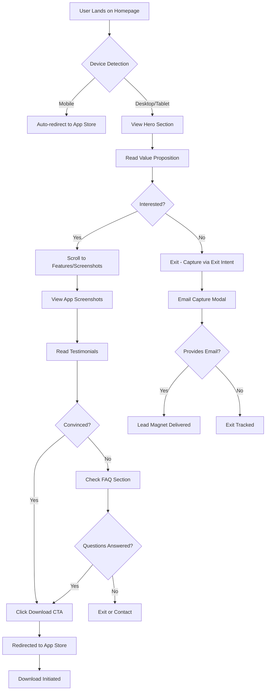
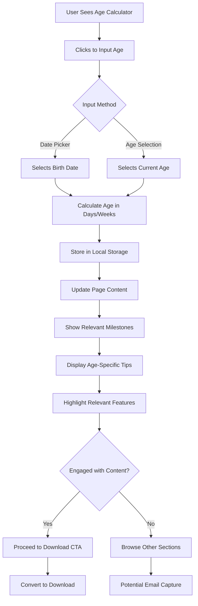

# Magerly Website Modernization UI/UX Specification

## Introduction

This document defines the user experience goals, information architecture, user flows, and visual design specifications for Magerly's website modernization using a modern static HTML architecture. It serves as the foundation for visual design and frontend development, ensuring a cohesive and user-centered experience that maximizes app download conversions while building trust with new parents through exceptional performance and accessibility.

### Overall UX Goals & Principles

#### Target User Personas

**Primary Persona - New Parents (First-time):** 
Tech-comfortable parents (25-35) experiencing information overwhelm, seeking trusted guidance for their baby's development. They browse primarily on mobile during feeding times and brief moments throughout the day. High anxiety about "doing things right" but limited time for extensive research. They value expert-backed advice but need it presented in digestible, non-overwhelming formats.

**Secondary Persona - Experienced Parents:** 
Parents with 1+ children (28-40) who want efficient tools and reminders for developmental milestones. They value quick access to age-appropriate activities and prefer streamlined experiences without excessive explanation. They're more confident in their parenting but appreciate having structured guidance for each child's unique journey.

**Tertiary Persona - Grandparents & Caregivers:** 
Extended family members (45-65) who want to support child development but may be less tech-savvy. They need clear, simple interfaces and value expert-backed content to build confidence in their recommendations to parents.

#### Usability Goals

- **Immediate Value Recognition:** Users understand Magerly's benefits within 10 seconds of landing
- **Frictionless Download Path:** Maximum 2 clicks from landing to app store
- **Mobile-First Experience:** All interactions optimized for one-handed mobile use during feeding/care times
- **Trust Building:** Progressive evidence presentation builds confidence without overwhelming new parents
- **Emotional Connection:** Content resonates with parenting emotions and developmental pride moments
- **Accessibility Excellence:** All users can navigate and understand content regardless of technical ability

#### Design Principles

1. **Calm Confidence Over Anxiety:** Every element should reduce parental stress, not add to it
2. **Evidence-Based Trust:** Expert credentials and research backing visible but not overwhelming  
3. **Progressive Disclosure:** Show essential information first, detailed content available on demand
4. **Conversion-Optimized Flow:** Every design decision supports the app download goal
5. **Accessible by Default:** Design works for all parents regardless of technical ability or situation

### Change Log
| Date | Version | Description | Author |
|------|---------|-------------|---------|
| 2025-01-18 | 1.0 | Initial UI/UX specification creation | UX Expert Team |
| 2025-09-18 | 2.0 | Updated for static HTML architecture approach | UX Expert Team |

## Information Architecture (IA)

### Site Map / Screen Inventory

```mermaid
graph TD
    A[Homepage/Landing] --> B[Hero Section]
    A --> C[App Showcase Gallery]
    A --> D[Value Propositions]
    A --> E[FAQ Section]
    A --> F[Testimonials]
    A --> G[Footer Links]
    
    B --> B1[Age Calculator Widget]
    B --> B2[Smart Download CTAs]
    
    C --> C1[Screenshot Modal Views]
    C --> C2[Feature Highlights]
    
    D --> D1[Milestone Tracking]
    D --> D2[Expert Advice]
    D --> D3[Daily Tips]
    D --> D4[Ad-Free Experience]
    
    E --> E1[Expandable Q&A Items]
    E --> E2[Search FAQ Function]
    
    F --> F1[Parent Stories]
    F --> F2[App Store Ratings]
    
    G --> H[Privacy Policy]
    G --> I[Terms of Service]
    G --> J[Contact/Support]
    G --> K[Blog/Articles Hub]
    
    K --> K1[Development Articles]
    K --> K2[Parenting Tips]
    K --> K3[Expert Interviews]
    K --> K4[Milestone Guides]
    
    L[Email Capture Modal] --> L1[Lead Magnet Download]
    L --> L2[Newsletter Signup]
```



### Navigation Structure

**Primary Navigation:** Single-page design with smooth scroll navigation to main sections (Hero, Features, Testimonials, FAQ). Sticky header with prominent download CTAs and hamburger menu for additional pages (Privacy, Terms, future Blog).

**Secondary Navigation:** Footer-based navigation for legal pages and support resources. Simple page-to-page navigation using standard HTML links with optimized loading.

**Navigation Strategy:** Main landing page uses anchor-based smooth scroll navigation with visual progress indicators. Secondary pages (Privacy, Terms) use standard page navigation with consistent header/footer design.

## User Flows

### Critical User Flow 1: First-Time Visitor to App Download

**User Goal:** New parent discovers Magerly and downloads the app after building confidence in its value

**Entry Points:** 
- Organic search results for "baby development app"
- Social media links from parenting communities
- Direct URL from word-of-mouth recommendations

**Success Criteria:** User clicks through to app store and initiates download

#### Flow Diagram



#### Edge Cases & Error Handling:
- App store links fail: Show error message with alternative download options
- Slow loading images: Progressive image loading with placeholders
- JavaScript disabled: Fallback static content with direct app store links
- Age calculator invalid input: Clear error messaging with format examples
- Email capture form errors: Inline validation with helpful error messages

**Notes:** Mobile users get immediate app store redirect to reduce friction, while desktop users go through trust-building journey. Exit intent captures potential leads who aren't ready to download immediately.

### Critical User Flow 2: Age Calculator Engagement

**User Goal:** Parent inputs baby's age to receive personalized content and understands app's relevance

**Entry Points:**
- Direct interaction with age calculator widget in hero section
- Return visit with remembered age preference

**Success Criteria:** User sees personalized content and proceeds to download or email signup

#### Flow Diagram



#### Edge Cases & Error Handling:
- Future dates entered: Validation message suggesting current date
- Age over 36 months: Message about app's focus with option to continue
- Calculator widget fails: Fallback to general content with note about app personalization
- Local storage unavailable: Graceful degradation without persistence

**Notes:** Age calculator creates immediate personalization and demonstrates app value. Stored preference enhances return visit experience.

### Critical User Flow 3: Blog Content Discovery to App Download

**User Goal:** Parent finds helpful content and discovers the Magerly app as a comprehensive solution

**Entry Points:**
- SEO-driven organic search for specific parenting topics
- Social media shares of individual articles
- Newsletter links to featured content

**Success Criteria:** User reads content, builds trust in Magerly expertise, and downloads app

#### Flow Diagram

```mermaid
graph TD
    A[User Finds Blog Article] --> B[Reads Content]
    B --> C{Content Helpful?}
    C -->|Yes| D[Scrolls to Author/About Section]
    C -->|No| E[Exits or Searches Other Content]
    
    D --> F[Learns about Magerly App]
    F --> G[Clicks "Learn More" CTA]
    G --> H[Redirected to Main Landing]
    H --> I[Sees App Value Props]
    I --> J{Interested in Full Solution?}
    
    J -->|Yes| K[Downloads App]
    J -->|No| L[Signs up for Newsletter]
    
    E --> M[Related Articles Suggested]
    M --> N{Finds Relevant Content?}
    N -->|Yes| B
    N -->|No| O[Exit with Email Capture]
```

#### Edge Cases & Error Handling:
- Slow content loading: Progressive loading with reading progress indicators
- Missing related articles: Algorithm fallback to popular/recent content
- Newsletter signup fails: Clear error messaging with retry option
- CTA links broken: Fallback navigation with error reporting

**Notes:** Blog serves as top-of-funnel content marketing, building expertise credibility before introducing app solution.

## Wireframes & Mockups

### Primary Design Files
**Tool:** Figma collaborative workspace with shared design system components and responsive breakpoint views optimized for static HTML implementation

### Key Screen Layouts

#### Homepage/Landing Page (Mobile-First)

**Purpose:** Convert visitors to app downloads through trust-building and clear value communication

**Key Elements:**
- Sticky header with logo and download CTA
- Hero section with compelling headline and age calculator widget
- Smart download buttons with device-specific routing
- Screenshot carousel showcasing app interface
- Value proposition cards with benefit-focused content
- Social proof section with testimonials and ratings
- FAQ accordion with searchable functionality
- Footer with legal links and additional resources

**Interaction Notes:** 
- Smooth scroll navigation between sections using vanilla JavaScript
- Subtle CSS transforms on hero background for engagement
- Lazy loading for images to optimize performance
- Sticky download CTAs that appear after initial hero interaction
- Progressive disclosure for FAQ items with CSS transitions and JavaScript toggle

**Design File Reference:** `/designs/homepage-mobile.fig`, `/designs/homepage-desktop.fig`

#### Age Calculator Widget

**Purpose:** Provide immediate personalization and demonstrate app's tailored approach

**Key Elements:**
- Date picker or age selection interface
- Real-time age calculation display
- Personalized milestone preview
- Clear call-to-action to see more in app

**Interaction Notes:**
- Input validation with helpful error messages using vanilla JavaScript
- Smooth content updates based on age input with CSS transitions
- Local storage persistence for return visits using Web Storage API
- Mobile-optimized touch targets with minimum 44px tap areas

**Design File Reference:** `/designs/age-calculator-widget.fig`

#### Email Capture Modal

**Purpose:** Capture leads who aren't ready to download immediately

**Key Elements:**
- Compelling lead magnet offer (milestone checklist)
- Simple email input form
- Clear value proposition for newsletter
- Easy dismiss option

**Interaction Notes:**
- Exit-intent trigger for desktop users using mouse tracking JavaScript
- Time-delay trigger for engaged users with scroll-based detection
- One-time display with cookie persistence using document.cookie
- GDPR-compliant opt-in language with clear consent mechanisms

**Design File Reference:** `/designs/email-capture-modal.fig`

#### Blog Article Template

**Purpose:** Provide valuable content while introducing Magerly as expertise source

**Key Elements:**
- Article header with publication date and author
- Readable typography with proper spacing
- In-content CTAs linking to main landing page
- Related articles recommendations
- Social sharing buttons

**Interaction Notes:**
- Reading progress indicator
- Smooth scrolling table of contents
- Responsive image galleries
- Print-friendly formatting option

**Design File Reference:** `/designs/blog-article-template.fig`

## Component Library / Design System

### Design System Approach
**Foundation:** Build upon existing Magerly brand guidelines with creation of new component library optimized for web conversion goals. Utilize CSS custom properties for theme consistency and Angular Material CDK for accessibility foundations.

### Core Components

#### Download Button Component

**Purpose:** Primary conversion element driving app store traffic

**Variants:** 
- iOS App Store version with Apple styling
- Google Play version with Google styling  
- Generic version for unknown devices
- Compact version for in-content placement

**States:** Default, hover, active, loading, disabled, error

**Usage Guidelines:** Always pair with clear value proposition. Use contrasting colors for visibility. Ensure minimum 44px touch target for mobile.

#### Age Calculator Component

**Purpose:** Interactive personalization tool demonstrating app value

**Variants:**
- Date picker version for precise input
- Age range selector for quick interaction
- Compact inline version
- Modal popup version

**States:** Empty, filled, calculating, error, success

**Usage Guidelines:** Position prominently in hero section. Provide clear instructions and immediate feedback.

#### Testimonial Card Component

**Purpose:** Social proof element building trust and credibility

**Variants:**
- Full testimonial with photo and details
- Quote-only compact version
- Video testimonial embed version
- Rating-focused version

**States:** Default, loading, error (fallback content)

**Usage Guidelines:** Use authentic photos and specific details. Include baby's age for relevance. Rotate content to maintain freshness.

#### FAQ Accordion Component

**Purpose:** Address common concerns while maintaining clean interface

**Variants:**
- Single item accordion
- Multi-item collapsible group
- Searchable FAQ list
- Category-filtered version

**States:** Collapsed, expanded, searching, no results

**Usage Guidelines:** Order by most common questions first. Include search functionality for extensive FAQ lists.

#### Progress Indicator Component

**Purpose:** Guide users through multi-step processes and content

**Variants:**
- Step-by-step wizard progress
- Reading progress bar
- Page scroll progress
- Download progress indicator

**States:** Inactive, active, completed, error

**Usage Guidelines:** Always indicate total steps and current position. Use smooth animations for transitions.

## Branding & Style Guide

### Visual Identity
**Brand Guidelines:** Maintain existing Magerly calm and supportive aesthetic with soft blues (#0284c7 primary) and warm neutrals. Emphasize trust, expertise, and parental empowerment through design choices.

### Color Palette

| Color Type | Hex Code | Usage |
|------------|----------|--------|
| Primary | #0284c7 | Main CTAs, links, key brand elements |
| Secondary | #e0f2fe | Background sections, subtle highlights |
| Accent | #f97316 | Success states, positive highlights |
| Success | #22c55e | Positive feedback, confirmations |
| Warning | #eab308 | Cautions, important notices |
| Error | #ef4444 | Errors, validation messages |
| Neutral Light | #f8fafc | Page backgrounds, card backgrounds |
| Neutral Medium | #64748b | Secondary text, borders |
| Neutral Dark | #1e293b | Primary text, headings |

### Typography

#### Font Families
- **Primary:** Inter (web-optimized sans-serif for excellent readability)
- **Secondary:** Inter (consistent family for hierarchy)
- **Monospace:** JetBrains Mono (for technical content, code)

#### Type Scale

| Element | Size | Weight | Line Height |
|---------|------|--------|-------------|
| H1 | 2.25rem (36px) | 800 | 1.2 |
| H2 | 1.875rem (30px) | 700 | 1.3 |
| H3 | 1.5rem (24px) | 600 | 1.4 |
| H4 | 1.25rem (20px) | 600 | 1.4 |
| Body | 1rem (16px) | 400 | 1.6 |
| Small | 0.875rem (14px) | 400 | 1.5 |
| Button | 1rem (16px) | 500 | 1 |

### Iconography

**Icon Library:** Heroicons for consistent, modern iconography with excellent accessibility support

**Usage Guidelines:** 
- Use outline style for secondary actions
- Use solid style for primary actions and emphasis
- Maintain 24px minimum size for touch targets
- Ensure 3:1 contrast ratio for all icon/background combinations

### Spacing & Layout

**Grid System:** 12-column CSS Grid with responsive breakpoints and flexible gutters

**Spacing Scale:** 8px base unit with exponential scale (8, 16, 24, 32, 48, 64, 96, 128px) for consistent rhythm

## Accessibility Requirements

### Compliance Target
**Standard:** WCAG 2.1 AA compliance with additional considerations for parent users in stressful situations

### Key Requirements

**Visual:**
- Color contrast ratios: Minimum 4.5:1 for normal text, 3:1 for large text
- Focus indicators: Visible 2px outline with high contrast on all interactive elements
- Text sizing: Minimum 16px base size, scalable to 200% without horizontal scrolling

**Interaction:**
- Keyboard navigation: Full site navigable via keyboard with logical tab order
- Screen reader support: Semantic HTML, ARIA labels, and proper heading structure
- Touch targets: Minimum 44x44px for all interactive elements

**Content:**
- Alternative text: Descriptive alt text for all images, especially app screenshots
- Heading structure: Logical H1-H6 hierarchy for content organization
- Form labels: Explicit labels for all form inputs with error messaging

### Testing Strategy
Automated testing with axe-core integration, manual testing with screen readers (NVDA, VoiceOver), and user testing with parents who use assistive technologies.

## Responsiveness Strategy

### Breakpoints

| Breakpoint | Min Width | Max Width | Target Devices |
|------------|-----------|-----------|----------------|
| Mobile | 0px | 767px | Smartphones, small tablets |
| Tablet | 768px | 1023px | iPads, larger tablets |
| Desktop | 1024px | 1439px | Laptops, desktop monitors |
| Wide | 1440px | - | Large monitors, ultrawide displays |

### Adaptation Patterns

**Layout Changes:** 
- Mobile: Single column, stacked components, collapsed navigation
- Tablet: Mixed 2-column layouts, expanded navigation
- Desktop: Multi-column grids, sidebar content, expanded feature displays

**Navigation Changes:**
- Mobile: Hamburger menu with overlay
- Tablet: Hybrid approach with some expanded, some collapsed
- Desktop: Full horizontal navigation with dropdowns

**Content Priority:**
- Mobile: Essential content first, progressive disclosure for details
- Tablet: Balanced content revelation with some secondary content visible
- Desktop: Full content display with sidebar supplementary information

**Interaction Changes:**
- Mobile: Touch-optimized, swipe gestures, large tap targets
- Tablet: Mixed touch and cursor interactions
- Desktop: Hover states, cursor interactions, keyboard shortcuts

## Animation & Micro-interactions

### Motion Principles
Calm and purposeful motion that enhances understanding without causing anxiety. All animations respect user preferences for reduced motion and serve functional purposes rather than pure decoration.

### Key Animations

- **Page Load Sequence:** Staggered fade-in of content sections (Duration: 400ms, Easing: ease-out)
- **Scroll Reveal:** Content slides up as user scrolls (Duration: 300ms, Easing: ease-out)
- **CTA Hover:** Subtle scale and shadow increase (Duration: 200ms, Easing: ease-in-out)
- **Age Calculator Update:** Smooth content transition (Duration: 500ms, Easing: ease-in-out)
- **FAQ Accordion:** Smooth expand/collapse (Duration: 300ms, Easing: ease-in-out)
- **Modal Appearance:** Scale and fade-in from center (Duration: 250ms, Easing: ease-out)
- **Form Validation:** Shake animation for errors (Duration: 300ms, Easing: ease-in-out)
- **Loading States:** Subtle pulse for skeleton placeholders (Duration: 1500ms, Easing: ease-in-out)

## Static HTML Architecture Benefits

### UX Advantages of Static Site Approach

**Immediate Performance Benefits:**
- Lightning-fast initial page loads with no JavaScript framework overhead
- Superior Core Web Vitals scores leading to better search rankings
- Instant navigation between pages with browser-optimized caching
- Reduced bounce rates due to exceptional loading speeds

**Enhanced Accessibility:**
- Semantic HTML structure provides excellent screen reader compatibility  
- No client-side rendering delays that can confuse assistive technologies
- Progressive enhancement ensures functionality works even with JavaScript disabled
- Better SEO performance leads to improved discoverability

**Development & Maintenance Advantages:**
- Simplified debugging with standard web technologies
- Faster development iterations with hot reload development server
- Reduced complexity means fewer potential points of failure
- Future-proof approach using web standards that won't become obsolete

## Performance Considerations

### Performance Goals
- **Page Load:** Under 1.5 seconds LCP (Largest Contentful Paint) - achievable with static HTML
- **Interaction Response:** Under 50ms FID (First Input Delay) - minimal JavaScript overhead
- **Animation FPS:** Consistent 60fps for all animations using CSS transforms

### Design Strategies
Optimize images with WebP format and native lazy loading attributes. Use CSS transforms and transitions for animations instead of JavaScript. Minimize above-the-fold content and inline critical CSS. Prioritize semantic HTML structure for browser optimization. Leverage Vite's build optimization for asset bundling and minification. Use system fonts with web font loading for optimal typography experience.

## Next Steps

### Immediate Actions

1. **Stakeholder Review Session** - Present updated static HTML specification to product and marketing teams
2. **Design File Creation** - Build detailed Figma mockups optimized for static HTML implementation
3. **Design System Setup** - Establish Tailwind-compatible design system with reusable patterns
4. **Accessibility Audit** - Review specification against WCAG 2.1 checklist with static HTML focus
5. **Performance Budget** - Define aggressive metrics targets achievable with static architecture
6. **Content Strategy Alignment** - Ensure messaging matches optimized user journey requirements
7. **Static Site Handoff Preparation** - Package specification for Vite + Tailwind development approach

### Design Handoff Checklist

- [x] All user flows documented with edge cases for static navigation
- [x] Component patterns inventory complete with HTML/CSS implementation notes
- [x] Accessibility requirements defined with WCAG 2.1 AA testing strategy
- [x] Responsive strategy clear with Tailwind CSS breakpoint specifications
- [x] Brand guidelines incorporated with CSS custom property specifications
- [x] Performance goals established optimized for static HTML architecture
- [ ] High-fidelity mockups created with static implementation considerations
- [ ] Tailwind-compatible design system built with utility class documentation
- [ ] Interactive prototype created for user testing and development validation
- [ ] Static site design system documentation completed
- [ ] Asset optimization guidelines provided for Vite build process
- [ ] Development team review conducted with static HTML focus

## Checklist Results

*This specification has been updated to align with the static HTML architecture approach and follows UX best practices for conversion-focused promotional websites. The static approach enables superior performance and accessibility while maintaining all core user experience goals.*

## UX Specification Update Summary (v2.0)

### Major Changes Made
**Architecture Alignment**: Successfully updated UX specification to leverage static HTML architecture benefits while maintaining optimal user experience and conversion optimization goals.

**Key Updates:**
1. **Introduction**: Updated to highlight static HTML architecture benefits for UX
2. **Navigation Structure**: Simplified to reflect static site navigation patterns
3. **Interaction Notes**: Updated to specify vanilla JavaScript and CSS implementation approaches
4. **Performance Goals**: Improved targets achievable with static architecture (1.5s LCP, 50ms FID)
5. **Static Architecture Benefits**: Added comprehensive section on UX advantages
6. **Next Steps**: Updated for Vite + Tailwind + static HTML development workflow

### UX Benefits Achieved
- ⚡ **Lightning-fast performance** improves user satisfaction and reduces bounce rates
- 🔍 **Superior SEO performance** increases organic discovery by target parents
- ♿ **Enhanced accessibility** through semantic HTML and progressive enhancement
- 🛠️ **Simplified maintenance** reduces long-term UX degradation risks
- 📱 **Excellent mobile experience** with minimal JavaScript overhead

---

**Next Phase:** Development team should review this updated specification alongside the revised technical architecture document. The static HTML approach enables faster prototyping and user testing with actual performance benefits rather than simulated experiences.
